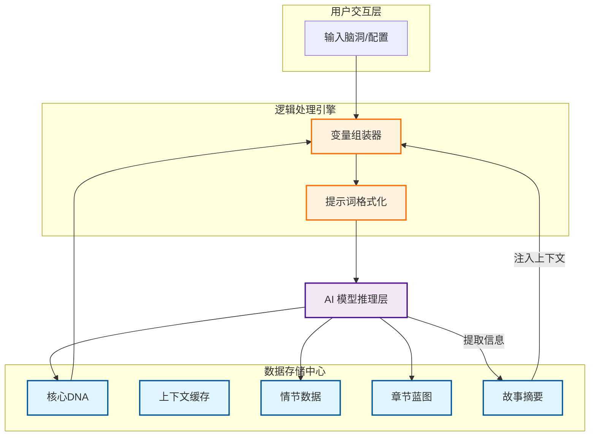
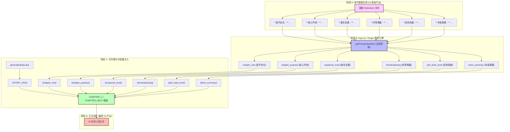
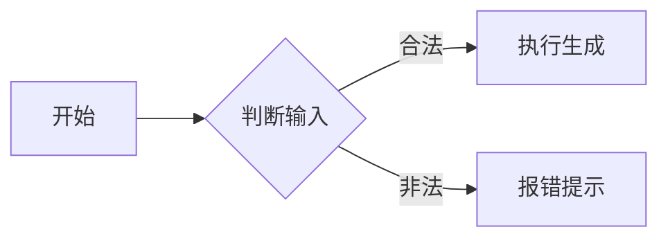
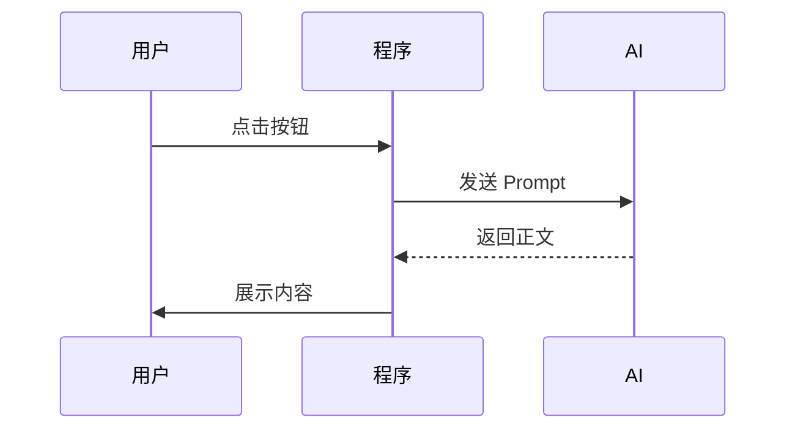

# Story Mind 使用指南与架构设计大师课

> [!NOTE]
> 本文档旨在帮助 **零基础学习者** 不不仅学会使用 Story Mind，更能理解一个复杂的 AI 应用是如何从逻辑层、数据层到表现层进行架构设计的。

---

## 📖 第一部分：用户创作心流 (User Creative Workflow)

在学习架构之前，先理解业务逻辑。Story Mind 的设计核心是：**“让 AI 像人类作家一样思考”**。

### 1. 业务流程拆解 (The 5-Step Process)

我们将创作过程拆分为五个解耦的步骤，每个步骤都有明确的输入和输出：

1.  **核心 DNA (Story DNA)**：解决“写什么”的问题（灵感、核心冲突、卖点）。
2.  **设定扩展 (World & Characters)**：解决“背景”问题（世界观、角色动机）。
3.  **情节架构 (Plot Architecture)**：解决“骨架”问题（大纲节拍、故事结构）。
4.  **分章蓝图 (Chapter Blueprint)**：解决“施工图”问题（细化到每一章要发生什么）。
5.  **正文写作 (Final Writing)**：解决“盖房子”问题（最终文字输出）。

---

## 🧠 第二部分：架构设计深度解析 (Architecturer's Notes)

### 1. 为什么要分这么多步？ (解耦思维)

**零基础小知识**：在架构设计中，这叫 **“单一职责原则 (SRP)”**。

- 如果你让 AI 一次性写完整本书，它会因为瞬间处理信息量太大而导致逻辑崩溃（幻觉）。
- 我们将大任务拆小，让每一步只负责一件事。这种“分而治之”的思想，是架构设计的基石。

### 2. 核心数据流架构 (The System Backbone)

通过下面的图，我们来学习如何表达“数据是如何流动的”：

**【如何看懂这张图？】**

- **方块 []**：代表一个功能节点。
- **实线箭头 -->**：代表数据的传递。
- **虚线线箭头 -.->**：代表逻辑上的演进或依赖。
- **颜色标注**：蓝色通常代表“静态存储”，紫色代表“外部服务 (AI)”，橙色代表“中间处理逻辑”。

---

## 🛠️ 第三部分：AI 上下文工程 (Context Engineering)

这是 Story Mind 最核心的技术点：**变量替换逻辑**。

### 1. 什么是变量替换？

在代码 `constants.ts` 中，你会看到很多 `{character_dynamics}` 这样的占位符。这就像填空题：系统根据您的设定，实时把这些括号里的东西替换成具体的故事内容。

### 2. 「黄金六标签」全链路流转图 (Variable Life Cycle)

为了解决 AI 在长篇创作中“记忆模糊”的问题，我们确立了一套 **「黄金六标签」** 标准。以下是这套数据流如何在创作全链路中实现 1:1 精准流转的展示：

### 3. 上下文同步 (Context Sync) ── 解决 AI “失忆”

**架构难点**：写到第 100 章时，AI 忘了第 1 章设定的伏笔怎么办？
**解决方案**：

- **状态回环 (State Feedback)**：每写完一章，系统会让 AI 对该章进行“压缩总结”。
- **全局摘要更新**：将这个总结归档到 `Global Summary` 中。
- **动态注入**：写下一章时，强制把这个 `Global Summary` 塞进 Prompt。

---

## 🎨 第四部分：Mermaid 绘图速成 (Mermaid Masterclass)

如果你想画出像 Story Mind 这样专业的图，记住以下三个最常用模版：

### 1. 流程图 (Flowchart) —— 表达“先后顺序”

### 2. 时序图 (Sequence Diagram) —— 表达“谁跟谁在做什么”

---

## 🚀 架构师总结

在 **Antigravity** 环境中工作，架构设计不再是纸上谈兵。作为一个深度的 AI 开发环境，这里的一切工具（包括我，Antigravity AI）都是为了辅助您实现从“点子”到“代码”的快速转化。

- **第一步**：理清输入和输出。
- **第二步**：定义中间的数据中转站 (Repository)。
- **第三步**：用双箭线表达交互逻辑。

恭喜你！读到这里，你已经踏上了成为 AI 产品架构师的旅程。

---

## 💻 第五部分：开发者与环境指南 (Developer & Environment Guide)

为了让 Story Mind 的“后厨”（开发环境）像“餐厅大堂”（生产环境）一样高效整洁，我们引入了一系列现代化的工程实践。

### 1. 样式架构升级 (Tailwind 4 + Local Build)

我们摒弃了传统的 CDN 挂载模式，采用了 **Tailwind CSS v4.0** 的本地编译方案。

- **为什么这么做？**
  - **零运行时警告**：彻底消除了浏览器控制台关于 `cdn.tailwindcss.com` 的生产环境警告。
  - **极速热更新 (HMR)**：修改 `style.css` 后，页面样式会毫秒级无刷新生效。
  - **CSS-First**：通过 `@theme` 和 CSS 变量管理设计系统，比 JS 配置更直观。

### 2. 开发体验优化 (DX - Developer Experience)

为了配合 Antigravity (VS Code) 环境，我们预装了“装修套件”：

- **自动格式化 (Prettier)**：已配置 `.prettierrc`。无论你怎么写，按下 `Ctrl + S` (保存) 时代码都会自动变得整齐划一。
- **智能提示**：`.vscode/settings.json` 已优化配置，确保 Tailwind 类名有自动补全和颜色预览，且不会在 CSS 文件中误报语法错误。

### 3. 常见问题排查 (Troubleshooting)

#### Q: 侧边栏在手机上看不见，或者在电脑上消失了？

- **原因**：Tailwind 4 默认使用原生的 CSS `translate` 属性，可能与旧版逻辑冲突。
- **解决方案**：我们已在 `App.tsx` 中显式注入了 `md:translate-x-0`，并在 `style.css` 中加了双重保险。**只要刷新页面，侧边栏就会自动归位。**

#### Q: 为什么 `index.html` 里还有链接？不是说本地化了吗？

- 这就是我们的 **“混合动力架构” (Hybrid Architecture)**：
  - **样式**：本地编译 (为了性能和语法检查)。
  - **核心库 (React)**：CDN 加载 (为了保持项目体积轻量，无需下载巨大的 node_modules)。
  - **字体**：Google Fonts (为了在这个极简应用中保持顶级的视觉审美)。

---
