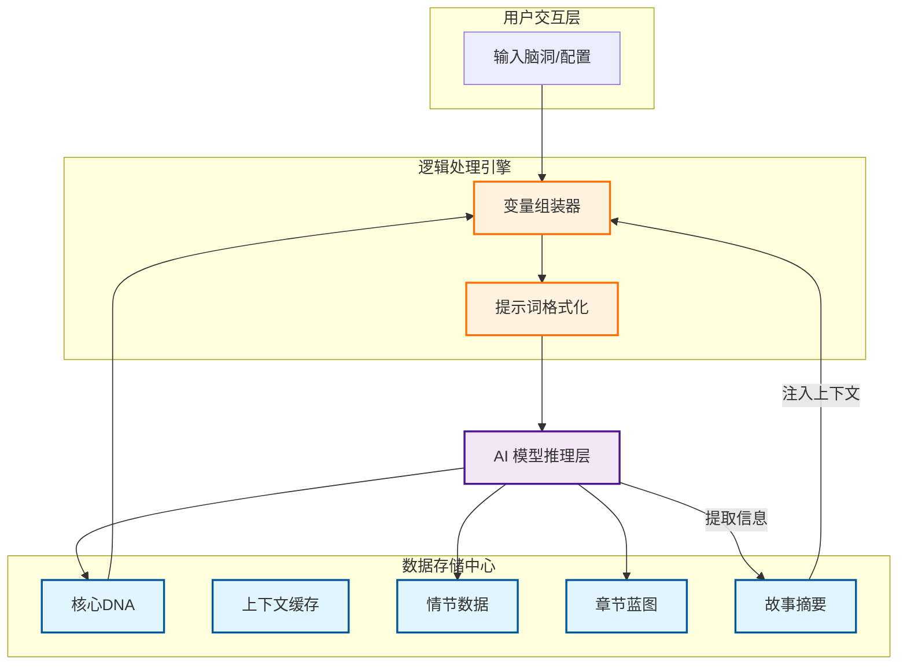
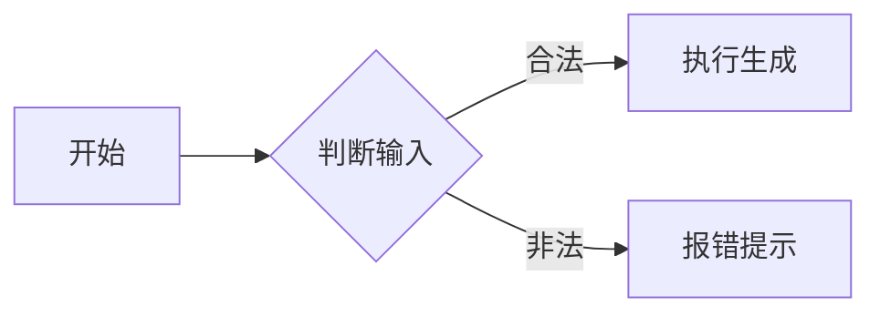
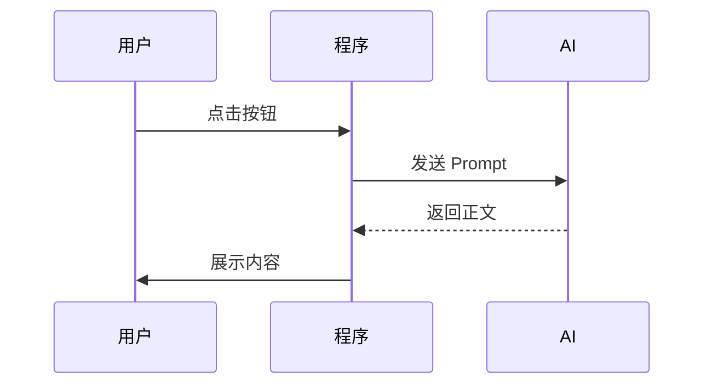

# Story Mind 使用指南与架构设计大师课

> [!NOTE]
> 本文档旨在帮助 **零基础学习者** 不仅学会使用 Story Mind，更能理解一个复杂的 AI 应用是如何从逻辑层、数据层到表现层进行架构设计的。

---

## 📖 第一部分：用户创作心流 (User Creative Workflow)

在学习架构之前，先理解业务逻辑。Story Mind 的设计核心是：**“让 AI 像人类作家一样思考”**。

### 1. 业务流程拆解 (The 5-Step Process)
我们将创作过程拆分为五个解耦的步骤，每个步骤都有明确的输入和输出：

1.  **核心 DNA (Story DNA)**：解决“写什么”的问题（灵感、核心冲突、卖点）。
2.  **设定扩展 (World & Characters)**：解决“背景”问题（世界观、角色动机）。
3.  **情节架构 (Plot Architecture)**：解决“骨架”问题（大纲节拍、故事结构）。
4.  **分章蓝图 (Chapter Blueprint)**：解决“施工图”问题（细化到每一章要发生什么）。
5.  **正文写作 (Final Writing)**：解决“盖房子”问题（最终文字输出）。

---

## 🧠 第二部分：架构设计深度解析 (Architecturer's Notes)

### 1. 为什么要分这么多步？ (解耦思维)
**零基础小知识**：在架构设计中，这叫 **“单一职责原则 (SRP)”**。
*   如果你让 AI 一次性写完整本书，它会因为瞬间处理信息量太大而导致逻辑崩溃（幻觉）。
*   我们将大任务拆小，让每一步只负责一件事。这种“分而治之”的思想，是架构设计的基石。

### 2. 核心数据流架构 (The System Backbone)
通过下面的图，我们来学习如何表达“数据是如何流动的”：

**【如何看懂这张图？】**
*   **方块 []**：代表一个功能节点。
*   **实线箭头 -->**：代表数据的传递。
*   **虚线线箭头 -.->**：代表逻辑上的演进或依赖。
*   **颜色标注**：蓝色通常代表“静态存储”，紫色代表“外部服务 (AI)”，橙色代表“中间处理逻辑”。

---

## 🛠️ 第三部分：AI 上下文工程 (Context Engineering)

这是 Story Mind 最核心的技术点：**变量替换逻辑**。

### 1. 什么是变量替换？
在代码 `constants.ts` 中，你会看到很多 `{character_dynamics}` 这样的占位符。这就像填空题：
1.  **模板**：“在一个名为 {world_name} 的世界里，生活着一个叫 {hero_name} 的人。”
2.  **变量组装**：系统从状态库里抓取数据：`world_name = "赛博荒漠"`, `hero_name = "阿强"`。
3.  **最终交付**：AI 收到的是完整的句子，它完全不需要知道后台数据是怎么存的。

### 2. 上下文同步 (Context Sync) ── 解决 AI “失忆”
**架构难点**：写到第 100 章时，AI 忘了第 1 章设定的伏笔怎么办？
**解决方案**：
*   **状态回环 (State Feedback)**：每写完一章，系统会让 AI 对该章进行“压缩总结”。
*   **全局摘要更新**：将这个总结归档到 `Global Summary` 中。
*   **动态注入**：写下一章时，强制把这个 `Global Summary` 塞进 Prompt。

---

## 🎨 第四部分：Mermaid 绘图速成 (Mermaid Masterclass)

如果你想画出像 Story Mind 这样专业的图，记住以下三个最常用模版：

### 1. 流程图 (Flowchart) —— 表达“先后顺序”

### 2. 时序图 (Sequence Diagram) —— 表达“谁跟谁在做什么”

---

## 🚀 架构师总结
一个好的架构图不是为了好看，而是为了**“让哪怕不懂代码的人，看图就能明白系统是怎么跑起来的”**。
*   **第一步**：理清输入和输出。
*   **第二步**：定义中间的数据中转站（Repository）。
*   **第三步**：用双箭线表达交互逻辑。

恭喜你！读到这里，你已经不仅是 Story Mind 的用户，更是一名 AI 产品架构的入门级学习者了。
